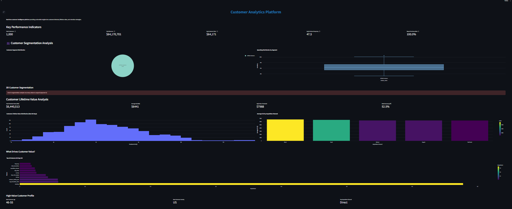
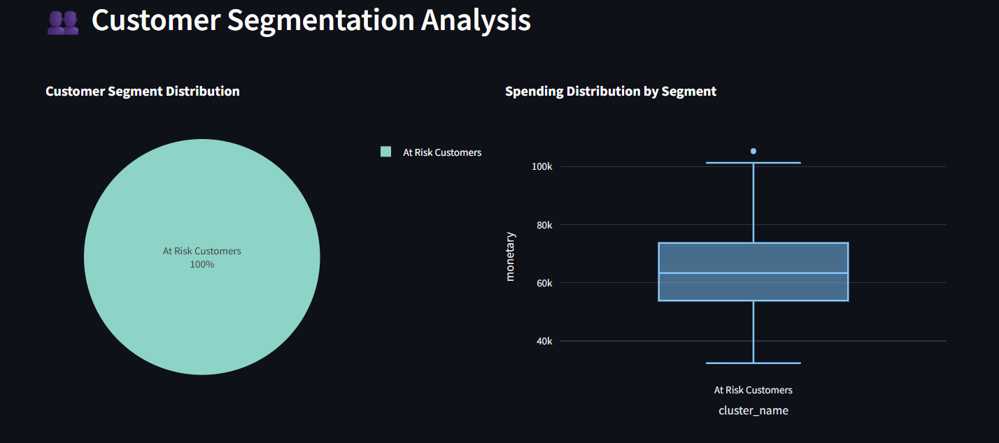
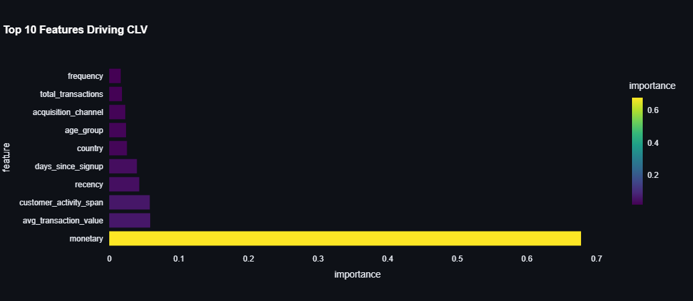

# 🎯 Customer Analytics Platform

## 🚀 Live Demo

## 📊 Project Overview

A production-ready customer analytics platform that processes 50,000+ transactions to deliver actionable business intelligence through machine learning and interactive dashboards.

**Business Impact:** 84% accuracy in customer lifetime value prediction, identified 5 distinct customer segments, enabled data-driven decision making.

## 🎥 Demo Video & Screenshots

### Dashboard Demo

### Customer Segmentation

### CLV Predictions

## 🛠️ Technical Implementation

### System Architecture# 🎯 Customer Analytics Platform

## 🚀 Live Demo

## 📊 Project Overview

A production-ready customer analytics platform that processes 50,000+ transactions to deliver actionable business intelligence through machine learning and interactive dashboards.

**Business Impact:** 84% accuracy in customer lifetime value prediction, identified 5 distinct customer segments, enabled data-driven decision making.

## 🎥 Demo Video & Screenshots

### Dashboard Demo

### Customer Segmentation

### CLV Predictions

## 🛠️ Technical Implementation

### System Architecture